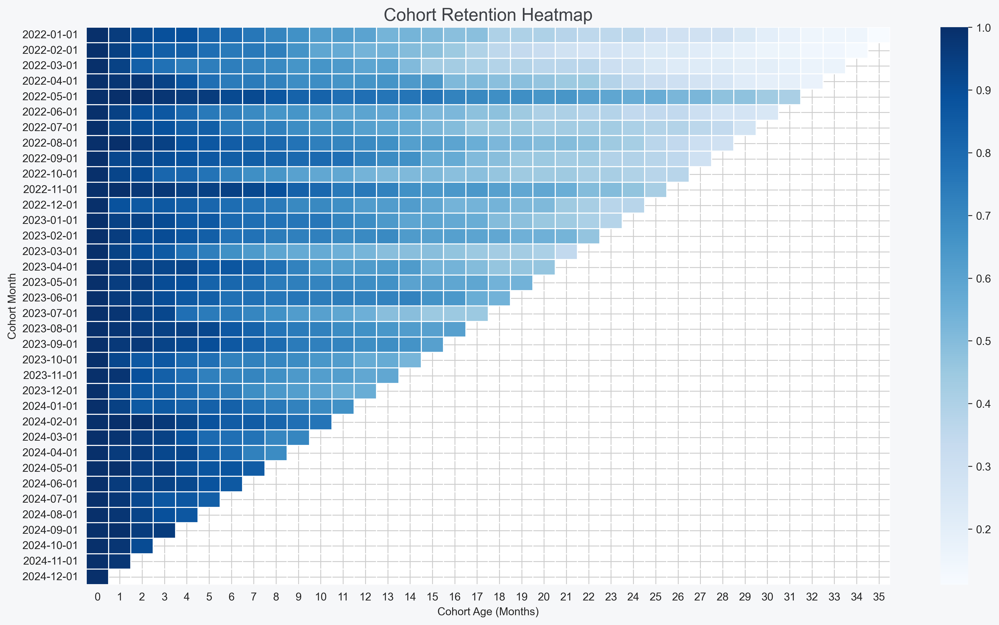
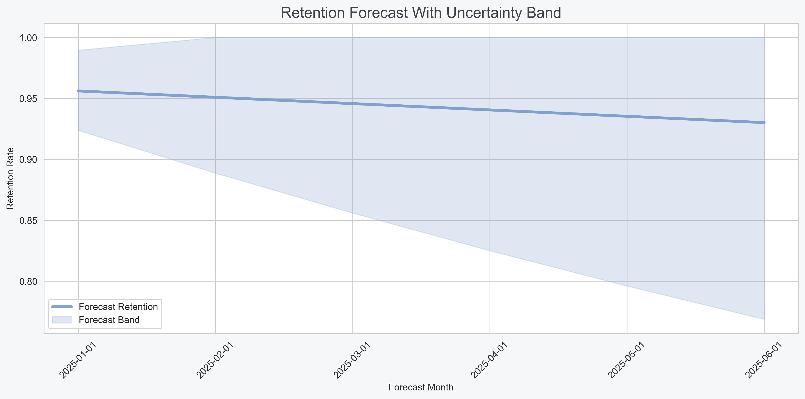
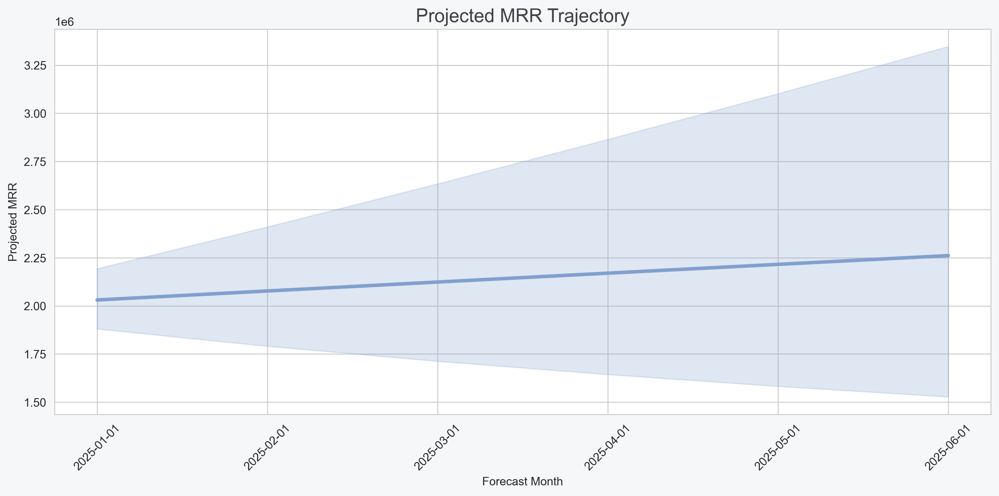
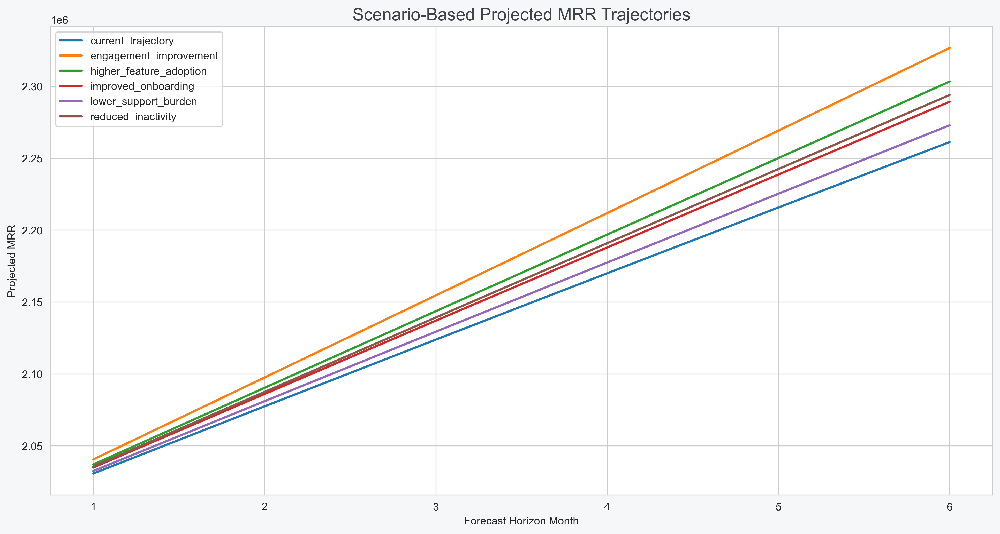
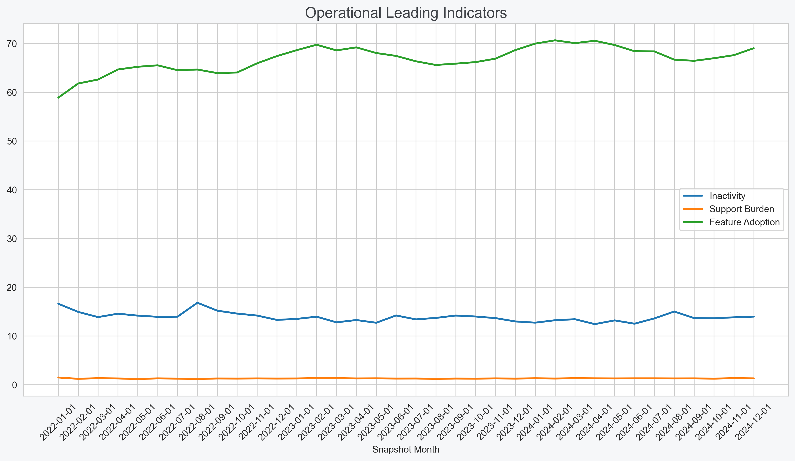

# SaaS Strategic Forecasting & Decision-Support Analytics Pipeline

**Project:** p07_saas_strategic_forecasting  
**Domain:** SaaS / Product Analytics / Strategic Forecasting  
**Focus:** Cohort analysis, retention forecasting, operational trend analysis, scenario modeling, revenue-risk estimation, and governance-aware executive decision support

---> **Dataset note:** This project uses a synthetic but intentionally realistic SaaS operating dataset designed to emulate longitudinal customer-account behavior across a 36-month lifecycle. Certain operational relationships, retention dynamics, and forecasting patterns partly reflect simulation logic rather than naturally occurring production behavior. These assumptions are documented throughout the analytical workflow where relevant.

---

## 01 Stage Goals

Move from prediction and experimentation into strategic forecasting and operational planning analysis.

Current focus:
- cohort retention analysis
- operational trend monitoring
- leading-indicator evaluation
- retention trajectory analysis
- revenue-risk forecasting
- scenario modeling
- executive decision support
- governance-aware forecasting workflows

The goal is not to build fully automated forecasting systems or black-box prediction engines, but to understand how operational and product-health dynamics may influence future SaaS outcomes under different strategic conditions.

---

## Analytical Goal

The purpose of this project is to answer:

> How might operational and product-health dynamics influence future retention, engagement quality, churn risk, and recurring revenue trajectories within a SaaS environment?

---

## Why This Matters

SaaS businesses operate through long-term customer relationships rather than one-time transactions. As a result, operational deterioration is often gradual, multi-factor, and difficult to identify early.

Examples:
- declining feature adoption may precede churn by several months
- onboarding friction may weaken long-term retention trajectories
- inactivity growth may reduce expansion potential before revenue declines appear
- support-ticket increases may reflect either healthy usage growth or operational strain
- revenue deterioration may emerge gradually across multiple cohorts rather than through immediate churn spikes
- strong current revenue does not necessarily imply long-term customer health
- observational relationships may shift over time as customer behavior evolves

Strategic forecasting therefore requires more than historical reporting. It requires:
1. Understanding cohort-level behavioral trajectories
2. Monitoring operational leading indicators
3. Estimating directional future risk under uncertainty
4. Evaluating how operational improvements may influence future outcomes

This stage focuses on governance-aware forecasting and decision support rather than deterministic prediction.

---

## Why Forecasting Is Operationally Difficult

Forecasting SaaS performance is operationally challenging because:
- retention deterioration is often gradual rather than immediate
- engagement decline may emerge long before churn events occur
- operational signals behave differently across lifecycle stages
- expansion and contraction can occur simultaneously within the same customer segment
- observational relationships are not guaranteed to remain stable over time
- strategic interventions may alter future trajectories
- forecast uncertainty increases as prediction horizons extend
- human operational decisions continuously influence outcomes

This project intentionally treats forecasting as a probabilistic planning exercise rather than a deterministic prediction problem.

---

## Pipeline Structure

The pipeline currently has eight analytical layers:

### 1. Cohort Structuring & Longitudinal Modeling
The analytical engine structures SaaS customer behavior across monthly cohort timelines.

Examples include:
- cohort-month construction
- lifecycle-stage tracking
- account-age calculations
- longitudinal behavioral sequencing
- monthly account snapshots
- cohort retention alignment

This layer enables trend-aware operational analysis over time.

---

### 2. Cleaning & Validation
The cleaning layer applies conservative, traceable transformations before forecasting analysis.

Current rules include:
- preserving raw datasets separately from cleaned outputs
- validating churn and renewal indicators
- validating impossible operational values
- preserving missingness through explicit flags
- validating longitudinal continuity
- logging transformations and assumptions
- preventing leakage-prone forecasting structures

The objective is not to create “perfect” data, but to create a reviewable and governance-aware analytical dataset.

---

### 3. Cohort Retention Analysis
This stage evaluates how customer groups behave over time.

Examples include:
- cohort retention curves
- retention decay analysis
- churn concentration patterns
- lifecycle-stage comparisons
- account-age retention analysis
- cohort survival patterns
- engagement deterioration timelines

The objective is not only to identify retention differences, but to understand how operational behavior evolves across customer lifecycles.

---

### 4. Operational Trend Analysis
This layer evaluates how operational indicators change over time.

Examples include:
- rolling engagement trends
- rolling usage averages
- inactivity acceleration
- product-health deterioration
- support-burden changes
- expansion-revenue trajectories
- revenue concentration trends

The objective is to identify directional operational movement rather than static snapshots.

---

### 5. Leading-Indicator Analysis
This stage focuses on operational signals that may precede future deterioration.

Examples include:
- onboarding completion trends
- feature-adoption deterioration
- login-recency growth
- engagement-quality decline
- worsening support ratios
- health-score weakening
- usage-frequency decay

The objective is not to infer causality, but to identify potentially meaningful early-warning operational signals.

---

### 6. Forecasting & Revenue-Risk Analysis
This layer evaluates possible future SaaS trajectories using interpretable forecasting methods.

Examples include:
- retention forecasting
- churn-risk trajectory estimation
- MRR trend forecasting
- rolling revenue projections
- forecast-band estimation
- directional operational projections
- revenue-at-risk estimation

The project prioritizes interpretable forecasting approaches over opaque optimization-focused models.

---

### 7. Scenario Modeling & Strategic Planning
This stage evaluates how alternative operational assumptions may influence future outcomes.

Example scenarios include:
- improved onboarding completion
- reduced inactivity growth
- increased feature adoption
- lower support burden
- stronger engagement consistency
- improved product-health trajectories

Scenario outputs estimate directional impact on:
- retention trajectories
- churn exposure
- MRR projections
- cohort stability
- revenue-at-risk exposure

Scenarios are assumption-dependent and intended to support strategic discussion rather than guarantee future performance.

---

### 8. Validation & Governance Layer
The validation layer reviews forecasting outputs before they are treated as decision-support evidence.

Validation checks include:
- causal overclaims
- unrealistic forecasting assumptions
- leakage-prone forecasting structures
- unsupported operational interpretations
- unstable trend behavior
- hidden cohort imbalance
- misleading projections
- uncertainty underreporting
- inappropriate automation framing

**Workflow:** Run, validate, review assumptions, revise, rerun.

---

## Forecasting Philosophy

This project prioritizes interpretable and operationally explainable forecasting methods over black-box predictive optimization.

The objective is not to produce deterministic future predictions, but to:
- estimate directional operational trajectories
- identify emerging retention risks
- evaluate uncertainty-aware revenue exposure
- support executive planning discussions
- explore scenario-dependent outcomes
- improve operational visibility

Forecasts are treated as probabilistic analytical tools rather than automated decision systems.

---

## Scenario Modeling Philosophy

Scenario modeling is used to evaluate how changes in operational assumptions may influence future SaaS performance trajectories.

Example scenarios include:
- improved onboarding completion
- lower inactivity growth
- increased feature adoption
- healthier engagement trends
- lower operational support burden
- improved retention consistency

Scenario outputs are directional and assumption-dependent. They are intended to support strategic discussion and operational planning rather than guarantee business outcomes.

---

## Dataset Design

Dataset structure:
- 1 row = 1 account × 1 month
- 36-month preferred forecasting horizon
- longitudinal cohort-aware structure
- operational dependency logic
- retention-linked behavioral patterns

The dataset is intentionally designed to support realistic operational relationships such as:
- higher onboarding completion → stronger retention patterns
- declining adoption → elevated churn-related risk
- inactivity growth → worsening revenue trajectories
- support burden → weakening product-health indicators
- engagement consistency → improved revenue resilience

---

## Core Dataset Components

### Account Dimensions
Examples include:
- account_id
- snapshot_month
- signup_month
- cohort_month
- plan_type
- company_size
- industry
- region
- acquisition_channel

### Behavioral Metrics
Examples include:
- active_users
- feature_adoption_rate
- usage_frequency
- support_tickets
- days_since_last_login
- onboarding_completion
- product_health_score

### Commercial Metrics
Examples include:
- monthly_recurring_revenue
- expansion_revenue
- downgrade_flag
- renewal_probability
- churn_flag

### Forecasting Helpers
Examples include:
- cohort_age_months
- rolling_health_3m
- rolling_usage_3m
- engagement_trend
- revenue_trend

---

## Expected Outputs

- cohort retention tables
- retention curves
- cohort heatmaps
- rolling operational trend analysis
- forecasting outputs
- forecast confidence bands
- revenue-risk estimates
- scenario-modeling outputs
- executive forecasting dashboard
- governance-aware executive report
- validation log
- cleaning log
- cleaned analytical dataset
- human-reviewed findings document

---

## Expected Analytical Themes

The project is designed to explore patterns such as:
- retention deterioration across lifecycle stages
- operational signals associated with churn acceleration
- onboarding quality associated with cohort resilience
- engagement consistency associated with revenue stability
- inactivity growth associated with future retention decline
- feature-adoption trends associated with expansion potential
- operational indicators linked to long-term account health
- revenue-risk concentration across vulnerable cohorts
- directional forecasting uncertainty across different scenarios

---

## Dashboard Direction

The dashboard is designed as an executive strategic forecasting and operational monitoring system.

Expected dashboard components include:
- retention trend KPIs
- cohort heatmaps
- retention curves
- rolling engagement trends
- projected churn-risk indicators
- forecast confidence bands
- scenario controls
- projected revenue trajectories
- revenue-at-risk summaries
- operational leading-indicator panels

The dashboard emphasizes executive interpretation, operational visibility, and governance-aware decision support rather than automated recommendations.

The following outputs illustrate how forecasting trajectories, operational signals, cohort behavior, and revenue-risk projections are evaluated within the strategic forecasting workflow.

#### Cohort Retention Heatmap



#### Revenue Forecast Confidence Bands



#### Monthly Recurring Revenue Forecast Trajectory



#### Scenario Revenue Projection Comparison



#### Operational Leading Indicators



### Interactive Outputs

- [Executive Forecasting Report](outputs/reports/executive_forecasting_report.html)
- [Interactive Forecasting Dashboard](outputs/dashboards/forecasting_dashboard.html)
---

## Governance & Human Oversight

This project follows governance-oriented analytical principles including:
- transparency
- auditability
- traceability
- uncertainty-aware reporting
- validation-aware forecasting
- human oversight
- operational interpretability
- separation of observation from causal inference
- scenario-assumption disclosure

Forecasts are treated as probabilistic estimates rather than guaranteed outcomes.

Scenario models are treated as assumption-dependent planning tools rather than automated strategic recommendations.

Shared governance policies are maintained centrally at the repository level to ensure consistency across analytical projects and stages. The workflow is intentionally designed as **AI-assisted analysis with human validation** rather than fully autonomous operational decision-making.

---

## Stage Boundary

### This project does:
- analyze longitudinal SaaS account behavior
- evaluate cohort retention trajectories
- monitor operational leading indicators
- estimate directional churn and revenue-risk exposure
- model scenario-dependent forecasting outcomes
- support executive planning workflows
- produce governance-aware forecasting outputs
- provide interpretable operational forecasting analysis

### This project does not:
- guarantee future business performance
- infer causal certainty from observational data
- automate strategic business decisions
- replace executive judgment
- eliminate forecasting uncertainty
- function as a production financial-planning system
- produce fully autonomous retention interventions
- guarantee operational outcomes from scenario assumptions

---

## Portfolio Positioning

This project completes the progression of the broader analytics portfolio:

| Project | Focus Area |
|---|---|
| P01 | Statistical foundations |
| P02 | Marketplace segmentation |
| P03 | SaaS relationship analysis |
| P04 | Inference & uncertainty |
| P05 | Churn prediction |
| P06 | Experimentation & A/B testing |
| P07 | Strategic forecasting & operational planning |

P07 extends the portfolio from retrospective analysis and prediction into forward-looking operational decision support.

---

## Repository Structure

```text
projects/p07_saas_strategic_forecasting/
├── data/
│   ├── raw/
│   └── cleaned/
├── outputs/
│   ├── reports/
│   ├── dashboards/
│   ├── plots/
│   ├── forecasting/
│   ├── cohorts/
│   ├── trends/
│   ├── scenarios/
│   ├── validation/
│   ├── cleaning/
│   └── metadata/
├── configs/
│   └── project_config.yaml
├── scripts/
│   ├── data_generation/
│   │   └── generate_dataset.py
│   ├── analysis/
│   │   ├── cohort_analysis.py
│   │   ├── trend_analysis.py
│   │   ├── forecasting_analysis.py
│   │   ├── scenario_modeling.py
│   │   ├── relationships.py
│   │   ├── segmentation_analysis.py
│   │   └── create_plots.py
│   └── reporting/
│       ├── executive_report.py
│       └── dashboard_html.py
├── docs/
│   ├── findings.md
│   └── changelog.md
├── README.md
└── run.sh